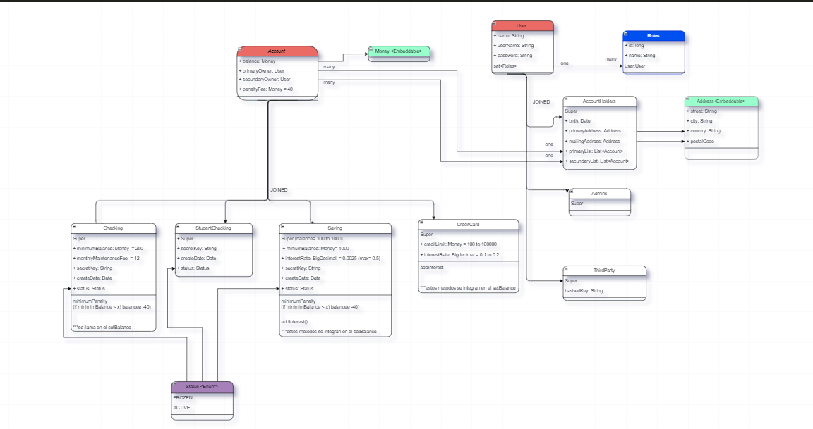
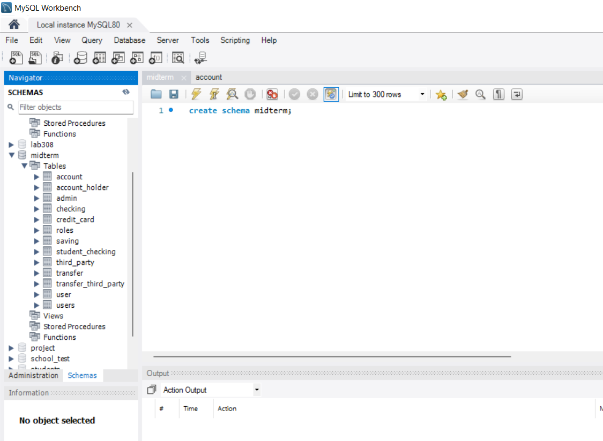
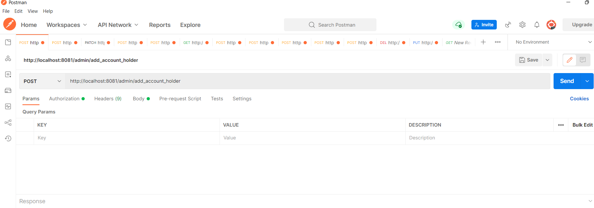
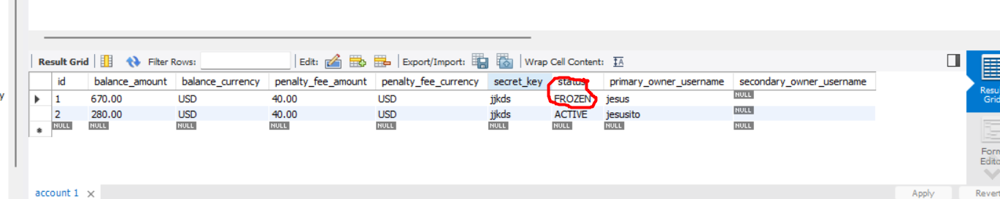

# REST API (Midterm Project)
## Technical Requirements
Include a Java/Spring Boot backend.
Everything should be stored in MySQL database tables.
Include at least 1 GET, POST, PUT/PATCH, and DELETE route.
Include authentication with Spring Security.
Include unit and integration tests.
Include robust error handling.
You must use the Money class for all currency and BigDecimal for any other decimal or large number math.
## Deliverables
A working REST API, built by you that runs on a local server.
A simplified class diagram representing your project structure should be added to the repo.

---
---
---
## PROJECT:

This is the original class diagram, there have been modifications to the Account class and 
I have added the Transfer and TransferThirdParty class.

These are the tables in the MySQL database.

All routes work fine, I have post, get and path routes.
Also, I have a put route where any aspect of thirdParty can be changed, depending on the optional parameters that are passed.
Many more routes can be created, but I have created the most significant ones.

---
## BONUS:

Fraud Detection
The application must recognize patterns that indicate fraud and Freeze the account status when potential fraud is detected.
Patterns that indicate fraud include:

- Transactions made in 24 hours total to more than 150% of the customers highest daily total transactions in any other 24 hour period.

- More than 2 transactions occurring on a single account within a 1 second period.

`I am very proud of myself, I was able to implement the second bonus.`

I was able to better understand the LocalDateTime library, it has many advantages!

** It remains to create the tests due to lack of time, it seems more interesting to me to try to get the bonus.
